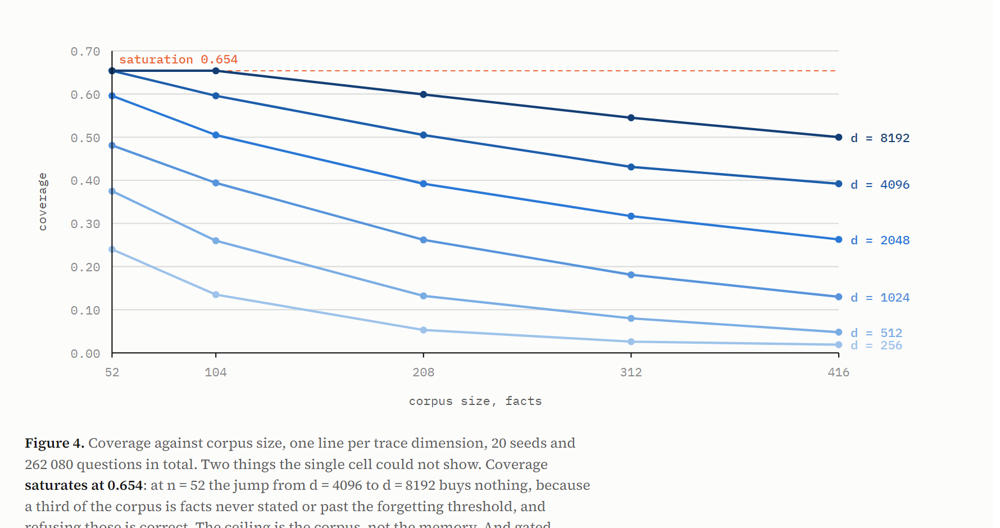

# membench

A benchmark for memory layers that **age**, with the controls that make its
numbers mean something.

Recall is the easy half of a memory layer. This measures four things that are
rarely measured together:

| | |
|---|---|
| **retention** | a fact stated once, long ago, never repeated |
| **supersession** | a fact updated since: does the stale value come back? |
| **age** | does the answer say it is old, or serve it as fresh? |
| **absence** | a fact never stated: refuse, or invent? |

Everything is measured against the same corpus, with the base model held
constant so the memory is the only thing that varies.

```
pip install numpy
export HOLOMEM_PATH=/path/to/holomem     # github.com/polmanas1998-star/holomem
python sweep.py --seeds 8                # offline, no API key, ~1 minute
```

Full write-up with figures: [`membench-report.pdf`](membench-report.pdf).

## Three layers of control

Most product benchmarks have none of these. They are borrowed openly: HELM
refuses a single headline score, tau-bench scores over repeated trials rather
than one run, GPQA and ARC-AGI validate that the task is hard before reporting
who solved it.

1. **Witnesses** validate the *harness*. One arm that never answers, one that
   always guesses, one that is perfect. If those three do not return three
   distinguishable verdicts, nothing is published. In particular a precision
   computed on zero answers is `n/m`, never `1.000`, or silence wins the
   benchmark.
2. **A trivial baseline** validates that there is something to beat: always
   answer the most frequent object in the corpus.
3. **A shortcut control** validates the *task*. The same memory layer, fed a
   timeline whose objects have been randomly redistributed. If it still scores,
   the questions were answerable without memory.

## Results, 832 questions over 8 seeds

Medians across seeds. `d = 2048`. Lower is better on `stale err` and `halluc`.

> **A median hides a rare error, and this table does.** It reports the memory
> layer at `gated precision 1.000`, while the error table further down reports 2
> hallucinations out of 176 absent facts. Both come from the same 832 questions
> and they cannot both be true: an answer on a fact never stated is answered and
> not correct, so it lowers precision. The median reads 1.000 because those 2
> errors live in a minority of seeds. **Pooled over all 8 seeds, precision is
> `0.995`.** A median describes a typical seed; only a pooled rate describes the
> system.

| arm | cover | gated P | retain | stale err | age | deep ret | halluc |
|---|---|---|---|---|---|---|---|
| oracle | 0.788 | 1.000 | 1.000 | 0.000 | 1.000 | 1.000 | 0.000 |
| majority baseline | 1.000 | 0.062 | 0.071 | 0.056 | 0.000 | 0.071 | 1.000 |
| **memory layer** | 0.500 | **1.000** | **1.000** | **0.000** | 1.000 | **0.000** | **0.000** |
| layer [scrambled] | 0.524 | 0.043 | 0.036 | 0.000 | 1.000 | 0.000 | 0.000 |

Paired bootstrap over the 832 questions, 4 000 draws, 95 % intervals:

| difference in gated precision | interval |
|---|---|
| layer − scrambled twin | **+0.959 [+0.939, +0.977]** |
| layer − trivial baseline | **+0.933 [+0.915, +0.950]** |
| layer − perfect oracle | −0.005 [−0.012, **+0.000**] |

The last band touches zero: the shortfall against a perfect oracle is not
distinguishable from sampling noise at this size. That is not the same as being
perfect.

### Two repetitions of a lie beat one statement of truth

The trace is a **sum** of `bind(S, R, O)`. Nothing in that addition separates a
fact said once from a fact said twenty times, or a true one from a false one.
So the question an industrial buyer asks first is not whether poisoning is
possible, but from how many repetitions, and whether it shows.

Threat model, stated: the attacker writes to the memory on the same terms as
the legitimate source. 12 attacked pairs per point, `d = 2048`, 60 background
facts so the attacker is not fighting an empty store.

| lies told | truth returned | silence | **lie returned** | median z |
|---|---|---|---|---|
| 1 | 0.50 | 0.00 | 0.50 | 4.45 |
| 2 | 0.08 | 0.08 | **0.83** | 5.04 |
| 3 | 0.00 | 0.00 | **1.00** | 6.11 |
| 8 | 0.00 | 0.00 | **1.00** | 6.37 |
| 20 | 0.00 | 0.00 | **1.00** | 6.54 |

Two things, and the second is worse than the first.

**Silence is `0.00` almost everywhere.** A layer that went quiet under attack
would be defensible: it would degrade cleanly. It does not go quiet. It
asserts.

**The confidence score rises with the attack.** From `4.45` at one repetition to
`6.54` at twenty. The gate does not merely miss the poisoning, it **rewards**
it: repetition makes the lie sharp, and sharpness is exactly what the gate
scores. A guard that measures how clearly a memory stands out will measure a
forgery just as clearly.

Repeating the truth helps a little and not for long. Stated three times, it
survives one and two lies; past that it is a weighted vote and whoever repeats
more wins.

**This is not an implementation bug.** A superposition carries no provenance, so
a legitimately reinforced fact and a repetition attack are structurally the same
event. The fix does not live in this layer. It lives in what is allowed to write
to it. Said plainly: this memory must never be writable by an untrusted party,
and no amount of tuning the gate changes that.

Reproduce with `python poisoning.py --seeds 12`.

### The uncomfortable result

The scrambled control keeps coverage at 0.524, slightly **above** the honest
layer's 0.500. It answers just as often while being wrong 96 % of the time, and
the confidence gate does not notice.

**The gate measures internal consistency, not correctness.** Fed well-formed
false memories, the layer is exactly as confident. No internal signal fixes
this; only corroboration against something outside the trace can.

## The capacity surface, 262 080 questions

Six trace dimensions by five corpus sizes by 20 seeds, entirely offline. A
product benchmark publishes one cell; the only thing this costs is local
compute, so there is no excuse for it.

Coverage:

| d \ n | 52 | 104 | 208 | 312 | 416 |
|---|---|---|---|---|---|
| 256 | 0.240 | 0.135 | 0.053 | 0.026 | 0.019 |
| 512 | 0.375 | 0.260 | 0.132 | 0.080 | 0.048 |
| 1024 | 0.481 | 0.394 | 0.262 | 0.181 | 0.130 |
| 2048 | 0.596 | 0.505 | 0.392 | 0.317 | 0.263 |
| 4096 | **0.654** | 0.596 | 0.505 | 0.431 | 0.392 |
| 8192 | **0.654** | **0.654** | 0.599 | 0.545 | 0.500 |



Three things one cell could not show.

**Coverage saturates at 0.654.** At n = 52, going from d = 4096 to d = 8192 buys
nothing. That is not a capacity limit, it is the corpus: roughly a third of every
corpus is facts never stated or past the forgetting threshold, and refusing those
is the correct answer. **The ceiling is the question set, not the memory.**

**Overload makes it silent, not wrong.** At d = 256 and n = 416 coverage collapses
to 0.019 while gated precision holds at 0.764. Across the other 29 cells precision
never drops below 0.905. A store pushed past its capacity stops answering rather
than starting to lie, which is the behaviour a confidence gate is for.

**The gap to the scrambled control never falls below +0.750**, anywhere on the
surface, including the most degraded corner. The task requires memory everywhere,
not only at the operating point that suits us.

Raw cells with their ranges: [`results-capacity-surface.json`](results-capacity-surface.json).
Reproduce with `python grid.py --seeds 20`, about 26 minutes on a laptop.

## Interference costs nothing measurable

A holographic trace is a sum of `bind(S, R, O)`, queried with
`unbind(trace, bind(S, R))`. When many facts share a subject, the noise the
others pour into the answer stops being independent: it is correlated by that
shared subject. This is the worst case for this design, and it is the real one,
because people talk about themselves, one project, one machine.

Fact count held **constant** at 30, same mix, same trace length. Only the
structure changes: the same facts concentrated onto fewer and fewer subjects.
Medians over 8 seeds.

Rates pooled over 8 seeds, not median.

| relations per subject | d = 128 | d = 2048 |
|---|---|---|
| | cover / precision | cover / precision |
| 10.0 (3 subjects) | 0.237 / **1.000** | 0.642 / **1.000** |
| 6.0 (5 subjects) | 0.204 / 0.980 | 0.650 / **1.000** |
| 3.8 (8 subjects) | 0.263 / 0.984 | 0.646 / 0.994 |
| 2.5 (12 subjects) | 0.233 / **1.000** | 0.654 / 0.994 |

Precision stays between `0.980` and `1.000` throughout, with no trend against
concentration, and the gap to the scrambled twin never falls below `+0.858`.
The residual errors are the same absent-fact hallucinations found everywhere
else, not a product of interference.

**A flat result accuses the instrument first**, so the sweep was repeated at
`d = 128`, where the memory is genuinely stressed: coverage drops from 0.65 to
0.25, which proves the store is near its limit and the gate is working. The
precision still does not move.

The reading is the same as the capacity surface: **overload makes it silent,
not wrong**, and correlated noise behaves like any other noise. Below the
confidence threshold the layer refuses rather than guesses.

Scope, honestly: 30 facts, three dimensions, a 4x range of concentration. A
wider range needs a larger subject vocabulary, which this corpus does not have.
Reproduce with `python interference.py --seeds 8 --dim 128`.

## Where the errors are

Outcome by question class, 8 seeds:

| class | correct | silence | wrong | stale value | hallucinated | n |
|---|---|---|---|---|---|---|
| stable | 144 | 0 | 0 | 0 | 0 | 144 |
| reinforced | 80 | 0 | 0 | 0 | 0 | 80 |
| superseded | 112 | 32 | 0 | **0** | 0 | 144 |
| faded | 75 | 101 | 0 | 0 | 0 | 176 |
| expired | 0 | 112 | 0 | 0 | 0 | 112 |
| absent | 0 | 174 | 0 | 0 | **2** | 176 |
| **total** | **411** | **419** | **0** | **0** | **2** | **832** |

On the 368 questions the system should be able to answer: **336 correct, 0
wrong.** Silence rises monotonically with how little it is entitled to know.

This table paid for itself. The first pass showed 3 wrong answers on facts past
the forgetting threshold, a class where the layer had *zero* correct answers out
of 112. Past that line the trace no longer holds the fact; what remains is noise,
and the confidence gate scores noise the way it scores a memory. Refusing the
class outright cost no correct answer and removed three of five errors.

> A confidence gate and an age gate are not the same thing. One asks how sharp a
> memory is, the other whether it has any right to exist. A system with only the
> first is confident about its own decay products.

That sentence was briefly withdrawn and is restored. The ablation table below
confirms it in numbers: removing the age gate costs 0.7 points of precision, the
3 errors it exists to catch. The withdrawal came from taking a median across
seeds, which cannot see an error that occurs in two seeds out of eight.

## Ablation: what each guard actually buys

Four pieces, removed one at a time. `d = 2048`, 8 seeds, 832 questions per row,
**rates pooled over all seeds**, entirely offline.

| variant | removed | cover | precision | halluc | stale | deep ret |
|---|---|---|---|---|---|---|
| **complete** | nothing | 0.496 | **0.995** | 0.011 | 0.000 | 0.000 |
| no z gate | the confidence threshold | 0.865 | 0.726 | **1.000** | 0.000 | 0.000 |
| no age gate | refusal past 111 days | 0.500 | **0.988** | 0.011 | 0.000 | 0.000 |
| no decay | the 45 day half-life | 0.620 | 0.880 | 0.011 | **0.417** | 0.000 |
| no weight floor | eviction below 0.18 | 0.499 | 0.995 | 0.011 | 0.000 | 0.000 |
| eternal memory | decay **and** age gate | 0.754 | 0.901 | 0.011 | 0.417 | **0.991** |

**The z gate is the product.** Remove it and hallucination on facts never stated
goes from `0.011` to `1.000`: it invents on every single one. Everything else in
this repository is a refinement; that one line is the thing being sold.

**Decay is what makes supersession work.** Remove it and a replaced value comes
back as current `0.417` of the time. The old and the new statement then compete
forever on equal weight, and the more often the old one was said, the better it
does.

**The age gate earns 0.7 points of precision**, `0.988` to `0.995`. Exactly the
3 errors it targets: facts at 159, 192 and 242 days that the memory answered
with a z above the confidence threshold. Small, real, and it took a second
instrument to see it.

**The weight floor changes nothing measurable here.** It is a noise and cost
optimisation, not a correctness one, and this table says so rather than letting
a reader assume otherwise.

**Deep retention is a choice, and here is its price.** The last row turns
forgetting off entirely: every fact past the threshold becomes recoverable,
`deep_retention` from `0.000` to `0.991`. It costs `0.417` stale values and nine
points of precision. That is the trade this design makes, stated as a number
rather than as a preference.

### The median nearly cost a published claim

The first version of this table took the **median** of per-seed rates. The 3
errors the age gate removes live in 2 seeds out of 8, so the median of
`[1, 1, 1, 1, 1, 1, 0.98, 0.97]` is `1.000`. The table showed the age gate
changing nothing at `d = 2048`, `4096` and `8192`, and on that basis a **true**
statement in this README was withdrawn and the guard documented as dead weight.

The calibration bench, which pools every seed, found the 3 errors sitting above
the threshold and sent the claim back.

A median is blind by construction to a rare event. A rare error rate is computed
over the **total** number of questions, never by summarising rates whose
denominators differ: that gives a seed with no errors the same weight as a seed
carrying three. Both this table and `interference.py` were rewritten to pool,
and a test now fails if anyone summarises by seed again.

Reproduce with `python ablation.py --seeds 8 --dim 2048`.

## Is the confidence score meaningful?

`gate_sweep.py` answers *where to cut*. This answers a harder question: **among
the answers it does give, does the score separate the right ones from the
wrong?** A threshold can work perfectly while the score above it carries no
information at all.

Gate disconnected, `z_gate = 0`, so every answer the layer would produce is
observed, including those it normally refuses. 832 answers, 8 seeds.

| z band | n | share correct |
|---|---|---|
| [1, 2) | 82 | 0.024 |
| [2, 3) | 228 | 0.211 |
| [3, 4) | 106 | 0.632 |
| [4, 5) | 61 | 0.918 |
| [5, 6) | 51 | **1.000** |
| [6, 8) | 89 | **1.000** |
| [8, inf) | 215 | **1.000** |

Strictly monotone. **Concordance 0.956**: draw one correct and one wrong answer
at random and the correct one carries the higher z 95.6 % of the time. That is
an AUROC, so it depends on no threshold and no choice of bands. Median z is
`6.89` on correct answers, `2.25` on wrong ones.

Above the cut at `z = 4` there are exactly 5 errors in 416 answers: **3 expired
facts and 2 never stated**. The age gate removes the first three. The last two
are the 2 hallucinations in the error table, and nothing in this design catches
them, because a fact that was never stated has no age to check.

### The three uncomfortable results are one result

Read with the scrambled control and the poisoning bench, this says something
precise. **The score measures how cleanly one candidate dominates the trace.**
On an honest trace, dominance and truth coincide almost perfectly, which is the
0.956 above. On a scrambled trace, dominance survives and truth does not. Under
a repetition attack, dominance is purchasable, and the score rises as the lie is
repeated.

The gate is not weak mathematics. It is a correct measurement of the wrong thing
whenever the trace stops being trustworthy, and its validity is inherited
entirely from control over who may write to it.

Reproduce with `python calibration.py --seeds 8`.

## The gate is a dial, not a number

Saying the layer answers half the questions describes one setting. 5 seeds:

| z | coverage | gated precision | hallucination |
|---|---|---|---|
| 1.0 | 0.865 | 0.711 | 1.000 |
| 2.0 | 0.798 | 0.800 | 0.682 |
| 3.0 | 0.596 | 0.952 | 0.091 |
| **4.0** | **0.490** | **1.000** | **0.000** |
| 5.0 | 0.423 | 1.000 | 0.000 |
| 8.0 | 0.250 | 1.000 | 0.000 |

The knee is sharp. Between z = 2 and z = 4 the layer trades a third of its
coverage for two tenths of precision, and hallucination on facts never stated
falls from 0.682 to zero.

## What is lost by design

Deep retention is `0.000` and does not move at d = 1024, 2048 or 4096. A fact
leaves the trace at **111.33 days**, which is 45 × log₂(1/0.18) from the
half-life and the weight floor; measured effective weight is 0.1809 on day 111
and 0.1781 on day 112. This is decay, not capacity. On any fact older than that,
a system that simply keeps the transcript recovers everything and this one
recovers nothing.

## External validity

The corpus is synthetic: 104 generated subject-relation-object facts about a
fictional architecture practice, on a simulated timeline. That buys exact ground
truth, a known denominator for every class, and byte-for-byte reproducibility
per seed. It does **not** buy:

- **natural language** — real users state facts in prose, ambiguously, across
  turns. Every fact here arrives as a clean triple, which flatters both this
  layer and any retriever it is compared to;
- ~~**realistic fact distributions**~~ — **this limitation was wrong, and is
  withdrawn.** It claimed that "one subject carrying many interfering relations"
  was absent. Measured 06/09/2026: the vocabulary holds 12 subjects and 10
  relations, so 120 pairs, and the default mix consumes 104 of them. The corpus
  runs at 87 % of pair saturation, with **8.7 relations per subject**.
  Interference was not absent, it was near maximal, and nobody had counted it.
  What is genuinely absent is natural interference *structure*: which subjects
  attract many relations is uniform here, where a real transcript is heavy-tailed;
- **a second domain** — one practice, one vocabulary of 29 objects;
- **a second base model** — every model-side number was taken on
  `openai/gpt-oss-120b`;
- **real ageing** — time is simulated.

What it does support are statements about the layer's own arithmetic under known
conditions: precision, refusal behaviour, the shape of the confidence curve and
the location of the forgetting threshold are properties of the algorithm.
Everything comparative is a hypothesis to be re-tested on real transcripts.

## Withdrawn, and not yet measured

**Withdrawn.** A cost comparison against a full-transcript arm and a top-k
retrieval arm was measured on 24 questions and is not published. Those runs used
a candidate list sorted identically in every question, so a model's position
preference could not be separated from its memory. The confound was found and
fixed after the measurement; the numbers will be re-taken, not amended.

**Not yet measured.** Those same arms across seeds at full corpus size. The free
tier allows 200 000 tokens a day and the measured refill after exhausting it is
663 tokens an hour, about one turn an hour, so a campaign has to start a day
after the last one ends.

## Harness

- **40 tests, 13 mutants of 13 killed.** Two tests were decorative until
  mutation found them, including one that guarded a counter without ever
  exercising the code that sets it.
- The significance test is itself guarded by comparing an arm against **itself**
  and requiring the interval to contain zero. The first implementation failed
  that: it reported a difference of exactly zero as significant.
- The candidate list is reshuffled per question from a seed derived from the
  question, so it is decorrelated from position and identical across arms.
- An unreadable answer is counted as unreadable, never as a principled refusal.
  A reasoning model given a 48 token output budget spends all 48 thinking and
  returns an empty string, which would otherwise score as perfect calibration.
- Token counts come from the provider's own usage figures, charged as prompt
  plus reservation, which is what the per-minute ceiling actually debits.
- Deterministic corpus per seed: a result is re-runnable byte for byte.

## Layout

| file | what it does |
|---|---|
| `membench/corpus.py` | the ageing corpus and its timeline |
| `membench/scoring.py` | the metrics, and what they refuse to compute |
| `membench/arms.py` | witnesses, trivial baseline, shortcut control |
| `membench/real_arms.py` | the four arms that see a model |
| `membench/stats.py` | paired bootstrap on differences |
| `membench/providers.py` | one provider, and the ceilings it enforces |
| `sweep.py` | the offline table, multi-seed |
| `interference.py` | precision against subject concentration |
| `poisoning.py` | how many repetitions of a lie beat the truth |
| `ablation.py` | what each guard buys, measured by removing it |
| `calibration.py` | whether the confidence score separates right from wrong |
| `gate_sweep.py` | the precision/coverage curve |
| `error_analysis.py` | outcome by question class |
| `bootstrap_report.py` | differences with intervals |
| `long_run.py` | resumable campaign that survives a daily ceiling |

MIT. Numbers are dated and carry their denominators. Anything withdrawn is named
as withdrawn rather than quietly dropped.
